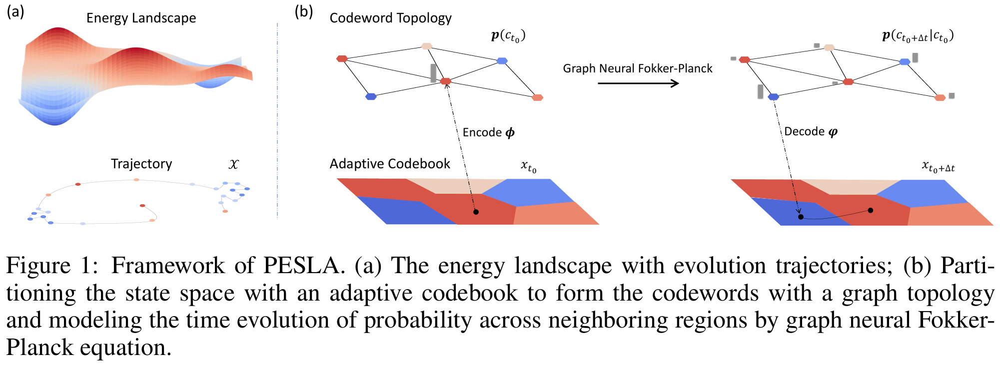

# 🌊 PESLA: Physics-informed Energy Self-supervised Landscape Analysis

This repository provides the official Python implementation of our **ICLR 2025** manuscript: 📄 *"Predicting the Energy Landscape of Stochastic Dynamical Systems via Physics-informed Self-supervised Learning"*.

<br>

**PESLA** introduces a novel framework for learning and predicting the energy landscape of stochastic dynamical systems, leveraging physics-informed self-supervised learning techniques.



<br>


## 🚀 Quick Start

### 📦 Required Dependencies

To get started, ensure the following dependencies are installed:

```
# platform: linux-64 (Ubuntu 11.4.0)
numpy==1.22.4
python==3.10.12
scikit-learn==1.3.0
scipy==1.11.2
torch==2.0.1+cu118
torchdiffeq==0.2.3
fast_pagerank==1.0.0
```

<br>

### 🏃 Running the Model

1️⃣ **Prepare Datasets**:

Download or simulate the datasets for the system of interest. Below are some examples:

- 2D Prinz Potential ([Deeptime](https://deeptime-ml.github.io/latest/datasets/sdes/plot_quadruple_well_asymmetric.html#sphx-glr-datasets-sdes-plot-quadruple-well-asymmetric-py))
- Ecological Evolution [(Defining Coarse-Grainability in a Model of Structured Microbial Ecosystems)](https://github.com/ryansmcgee/ecoevocrm)
- Protein Folding ([How Fast-Folding Proteins Fold](https://www.science.org/doi/10.1126/science.1208351))

2️⃣ **Run the model**:

- Specify the dataset by modifying the `system` field in `config.yaml`

- Execute the following command: 

  ```sh
  python main.py
  ```

<br>

## 📁 Repository Structure

```sh
.
├── README.md
├── asset
│   └── image.png
├── config.yaml
├── data
│   ├── __init__.py
│   └── dataset.py
├── main.py
├── model
│   ├── __init__.py
│   ├── ae.py
│   ├── codebook.py
│   ├── dynamics.py
│   ├── model_4well.py
│   ├── model_homeodomain.py
│   └── model_sswm.py
└── utils.py
```

<br>

## 📜 Citation

```sh
@inproceedings{lipredicting,
  title={Predicting the Energy Landscape of Stochastic Dynamical System via Physics-informed Self-supervised Learning},
  author={Li, Ruikun and Wang, Huandong and Liao, Qingmin and Li, Yong},
  booktitle={The Thirteenth International Conference on Learning Representations}
}
```

<br>

## 📝 License

Released under the [MIT](https://github.com/hustvl/GaussTR/blob/main/LICENSE) License.
